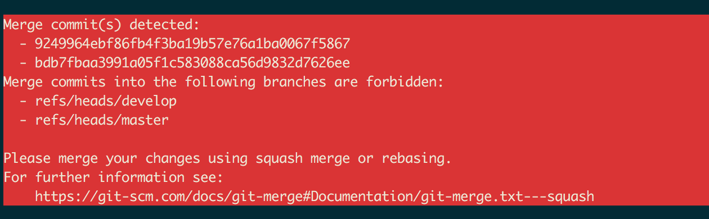

# githooks

## Reject Merge Commits

This webhook rejects the push of new merge commits to the remote.
This can be helpful to ensure that nobody sends new merge commits to the Remote Repository.

### Install
Copy the file `githooks/pre-push` to your local directory `.git/hooks/pre-push`.


#### Customize
By default the branches `develop` and `master` are restricted only.
To restrict custom branches, modify the variable `$restrictedBranches` in the file `pre-push`.

```
restrictedBranches=(refs/heads/develop refs/heads/master)
```

### Usage
Let's assume we have the branch "develop" with a merge commit in our local repository that we want to push to the remote repository.

```
git push origin develop
```

An example error could be looking like this:
